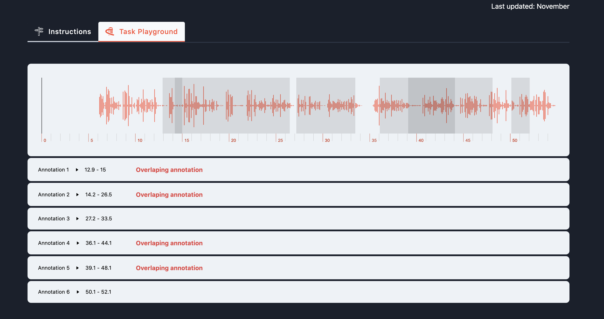
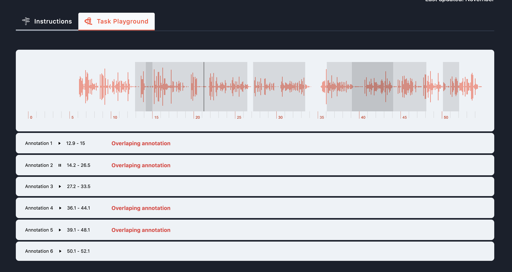

# Front-end

A small application to visualise an audio file with WaveSurfer.

### Running in Local

`yarn install --dev`

`yarn run`

## screenshot

It allows for a richer interface, and acts like an example for the candidates.
